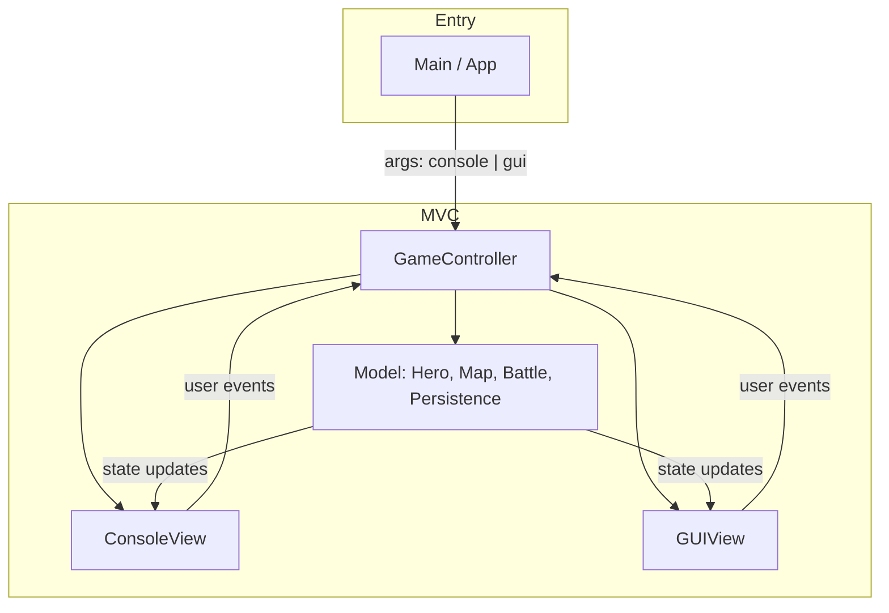
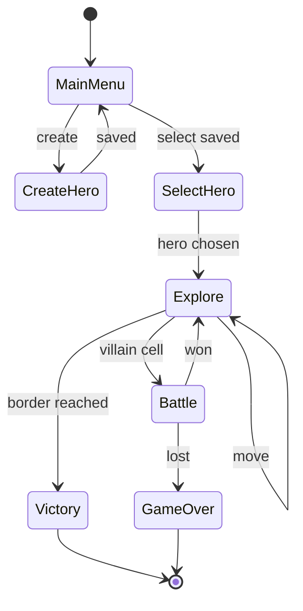

# Swingy — Step-by-Step Implementation Plan

Based on the [official subject PDF](https://cdn.intra.42.fr/pdf/pdf/210654/en.subject.pdf) and the current repo state: a Hello World Swing scaffold in [`my-swing-app/`](my-swing-app/) with no game logic, no MVC, and a bare [`pom.xml`](my-swing-app/pom.xml) (no Java version, no shade plugin, no validator).

---

## Architecture target



The **Controller** owns game flow (menu → hero select → explore → battle). **Views** only render and collect input; they never mutate game rules directly.

---

## Phase 0 — Project foundation

**Goal:** Runnable JAR, proper packages, Java 17.

1. **Rename and restructure Maven module**
   - Change `artifactId` to `swingy`, `groupId` to your namespace (e.g. `com.swingy`).
   - Set `maven.compiler.source` / `target` to **17** (subject allows latest LTS).
   - Add [`maven-jar-plugin`](https://maven.apache.org/plugins/maven-jar-plugin/) with `Main-Class` manifest entry.
   - Add [`maven-shade-plugin`](https://maven.apache.org/plugins/maven-shade-plugin/) (or assembly) so `mvn clean package` produces **`swingy.jar`** runnable via:
     ```bash
     java -jar swingy.jar console
     java -jar swingy.jar gui
     ```
   - Parse `args[0]` in main; reject invalid modes with a clear message.

2. **Package layout** (replace `com.example`)
   ```
   com.swingy
   ├── model/          # Hero, Artifact, Villain, GameMap, BattleSimulator
   ├── controller/     # GameController, input handlers
   ├── view/
   │   ├── console/    # ConsoleView
   │   └── gui/        # GUIView, panels
   ├── persistence/    # HeroRepository (file I/O)
   ├── validation/     # Custom validators if needed
   └── util/           # XP formula, map size calc
   ```

3. **Define a `View` interface** early so both console and GUI implement the same contract (`displayMessage`, `promptHeroCreation`, `displayMap`, `promptMovement`, `promptFightOrRun`, etc.).

---

## Phase 1 — Domain model (no UI yet)

**Goal:** Pure Java objects + unit-testable game rules.

### 1.1 Hero types and stats

- Define **3–5 hero classes** (Warrior, Mage, Rogue, etc.) with distinct base **Attack**, **Defense**, **Hit Points**.
- `Hero` fields: name, class, level, experience, attack, defense, hitPoints, equipped artifacts (weapon / armor / helm slots).
- Stats = base class stats + level bonuses + artifact bonuses (define simple scaling, e.g. +5% per level or flat increments).
- Implement **Builder pattern** for `Hero` creation (subject requirement).

### 1.2 Artifacts

- Types: **Weapon** (+attack), **Armor** (+defense), **Helm** (+hit points).
- Properties: name, stat bonus, quality tier (derived from villain strength when dropped).
- Hero can **equip** (replace slot) or **leave** dropped loot.

### 1.3 Experience and leveling

Formula from subject: XP to reach next level = `level * 1000 + (level - 1)² * 450`

| Level | XP needed |
|-------|-----------|
| 1 → 2 | 1000 |
| 2 → 3 | 2450 |
| 3 → 4 | 4800 |
| … | … |

- On level-up: recalculate derived stats; optionally heal partially.

### 1.4 Map

- Size: `(level - 1) * 5 + 10 - (level % 2)` → e.g. level 7 → **39×39**.
- Hero starts at **center**; win by reaching **any border cell**.
- Grid stores: empty, hero, villain (each villain has power/stats).

### 1.5 Villains

- Random placement at map generation; power scales with hero level.
- When hero enters villain cell → fight or run prompt.

### 1.6 Battle simulator

- Turn-based or round-based simulation using hero vs villain stats.
- Include a small **luck/random** factor so outcomes aren’t deterministic.
- Outcomes:
  - **Hero wins:** XP (based on villain power), possible artifact drop (not guaranteed; quality varies).
  - **Hero loses:** death → mission lost.
- **Run:** 50% return to previous tile; otherwise forced fight.

Write **JUnit tests** for: map size formula, XP thresholds, battle edge cases, run probability (mock `Random`).

---

## Phase 2 — Game controller and console flow

**Goal:** Fully playable text game before touching Swing.

Implement `GameController` with this loop:



**Main menu:** Create hero | Select hero | Quit

**ConsoleView responsibilities:**
- Read/write via `Scanner` + `System.out`.
- Display hero stats table, ASCII map (use symbols: `@` hero, `V` villain, `.` empty, `#` border).
- Prompt: movement (N/E/S/W), fight/run, keep/leave artifact.

Wire controller to a **stub GUIView** (no-op or “not implemented”) to enforce MVC early.

---

## Console mode — user manual (no UI)

Use this section while developing and testing **before the GUI exists**, and copy the final version into the README. All interaction happens in the terminal via typed input and printed output.

### Launch

```bash
mvn clean package
java -jar swingy.jar console
```

If no mode argument is given, print usage and exit (or default to console during early development — pick one and document it).

### Main menu

On startup the app loads saved heroes from the persistence file, then shows:

```
=== Swingy ===
1) Create a hero
2) Select a hero
3) Quit
>
```

| Input | Action |
|-------|--------|
| `1` | Go to hero creation |
| `2` | Go to hero selection (error if no saved heroes) |
| `3` | Save all heroes and exit |
| anything else | Show error, re-prompt (do not crash) |

### Create a hero

```
Enter hero name:
> Arthur

Choose class:
1) Warrior
2) Mage
3) Rogue
> 1
```

After validation passes, display the new hero’s stats (name, class, level, XP, attack, defense, hit points) and return to the main menu. The hero is saved immediately.

**Validation failures** (re-prompt without leaving the flow):

- Empty or too-short/long name → show Hibernate Validator message, ask again
- Invalid class choice → show error, ask again
- Duplicate hero name → show error, ask again (recommended)

Example error:

```
Name must be between 2 and 20 characters.
Enter hero name:
>
```

### Select a hero

List saved heroes with stats, then prompt:

```
Select hero number (or 0 to cancel):
> 1
```

Choosing a valid hero starts a **new mission** (fresh map for that hero’s current level). `0` returns to the main menu.

### Exploration screen (each turn)

Each turn, print:

1. **Hero stats** — name, class, level, XP, attack, defense, HP, equipped artifacts
2. **ASCII map** — centered on the hero (or full map if small enough)

Suggested legend (document in README):

| Symbol | Meaning |
|--------|---------|
| `@` | Hero (current position) |
| `V` | Villain |
| `.` | Empty tile |
| `#` | Map border (win if hero steps here) |

Then prompt:

```
Move (N/S/E/W) or Q to quit mission:
>
```

| Input | Action |
|-------|--------|
| `N` / `S` / `E` / `W` | Move one tile (case-insensitive) |
| `Q` | Abandon mission, save hero progress, return to main menu |
| invalid | Show error, re-prompt same turn |

**Win:** hero reaches any border cell → print victory message, save hero (XP/artifacts kept), return to main menu.

**Villain encounter:** when the hero enters a cell with a villain, skip the movement prompt and go straight to the encounter flow below.

### Villain encounter

```
A villain blocks your path!
1) Fight
2) Run
>
```

| Choice | Result |
|--------|--------|
| **Fight** | Run battle simulation, print round-by-round or summary outcome |
| **Run** | 50% chance to return to previous tile; otherwise forced fight |

### Battle outcome

**Hero wins** — print XP gained and current level. If XP threshold reached, print level-up and updated stats.

If an artifact drops:

```
The villain dropped: Iron Sword (+5 Attack)
1) Keep (equip)
2) Leave
>
```

If nothing drops, continue to the next turn.

**Hero loses** — print death message, mission ends, return to main menu. Hero remains in the roster but the current run is lost (define whether HP resets on next mission).

### Example session (abbreviated)

```
=== Swingy ===
1) Create a hero
2) Select a hero
3) Quit
> 1

Enter hero name:
> Lancelot
Choose class:
1) Warrior  2) Mage  3) Rogue
> 1

Hero created: Lancelot (Warrior) — Lvl 1, ATK 15, DEF 10, HP 50

> 2

1) Lancelot — Warrior, Lvl 1, ATK 15, DEF 10, HP 50
Select hero number (or 0 to cancel):
> 1

--- Lancelot | Lvl 1 | XP 0/1000 | HP 50/50 ---
     . . . . .
     . . @ . .
     . . V . .
     . . . . .

Move (N/S/E/W) or Q to quit mission:
> E

A villain blocks your path!
1) Fight  2) Run
> 1

You defeated the villain! +120 XP.
Move (N/S/E/W) or Q to quit mission:
> N
...
```

### Manual testing checklist (console only)

Use this to verify the no-UI path before building Swing:

- [ ] Launch with `console` argument
- [ ] Create hero with valid and invalid names
- [ ] Select hero from empty and non-empty lists
- [ ] Move in all four directions; invalid input re-prompts
- [ ] Fight and win — XP, level-up, artifact keep/leave
- [ ] Fight and lose — mission ends cleanly
- [ ] Run — observe ~50% escape over many trials
- [ ] Reach border — victory message and save
- [ ] Quit from main menu — heroes persisted
- [ ] Restart app — previously created heroes load correctly

---

## Phase 3 — Input validation (Hibernate Validator)

**Goal:** Annotation-based validation; invalid input never crashes the game.

1. Add dependency (only allowed external lib per subject):
   ```xml
   org.hibernate.validator:hibernate-validator
   ```
   Plus EL implementation required at runtime (`org.glassfish:jakarta.el` or similar).

2. Annotate hero creation DTO / `HeroBuilder` input:
   - `@NotBlank`, `@Size(min=2, max=20)` on name
   - `@NotNull` on class
   - Custom `@Pattern` or validator if needed (alphanumeric name, etc.)

3. Central **ValidationService** using `ValidatorFactory` → on failure, return constraint messages to the active view for display.

**Learn:** [Bean Validation spec overview](https://beanvalidation.org/) — annotations + `Validator.validate()`. No need to read the full spec; the Hibernate Validator [getting started](https://hibernate.org/validator/documentation/getting-started/) page is enough.

---

## Phase 4 — Persistence (text file)

**Goal:** Heroes survive between sessions.

- Define a **serialization format** (one hero per block, or line-delimited key=value — keep it human-readable for defense).
- `HeroRepository`: `loadAll()` on startup, `save(Hero)` on create/update, `saveAll()` on exit.
- Persist: name, class, level, XP, stats, equipped artifacts, position if mid-game (subject says “heroes and their state” — clarify with peers whether in-progress map is required; safest: save hero roster + optional last session state).
- Handle corrupt/missing file gracefully (empty list, log warning).

File path: e.g. `heroes.txt` in user home or project data dir (document the choice in README).

---

## Phase 5 — Swing GUI view

**Goal:** Same game through `java -jar swingy.jar gui`.

Build `GUIView implements View` using **only what you need** from Swing (see learning resources below).

### 5.1 Minimum UI screens

| Screen | Swing components |
|--------|------------------|
| Main menu | `JPanel` + `JButton` (Create / Select / Quit) |
| Hero creation | `JTextField` (name), `JComboBox` (class), validation error `JLabel` |
| Hero list | `JList` or `JTable` |
| Game | Map panel (grid of `JLabel` or custom `JPanel` + `paintComponent`), stat sidebar, N/E/S/W buttons |
| Battle | Dialog (`JOptionPane` or `JDialog`) — Fight / Run |
| Loot | Keep / Leave buttons |

### 5.2 Swing essentials to apply

- Always mutate UI on the **EDT**: `SwingUtilities.invokeLater(...)` (already in [`App.java`](my-swing-app/src/main/java/com/example/App.java)).
- Use a **layout manager** (`BorderLayout` for shell, `GridLayout` for map grid) — avoid absolute positioning.
- **ActionListener** on buttons → delegate to controller (never put game logic in listeners).
- Optional: `KeyBindings` for WASD/arrow movement.

### 5.3 Controller ↔ GUI threading

- Long tasks (battle sim) can stay on EDT if instant; for responsiveness, run heavy work on background thread and `invokeLater` to update UI.
- View exposes callbacks/interface methods the controller calls after state changes (`updateMap()`, `showBattleResult()`).

Replace the demo [`MainFrame.java`](my-swing-app/src/main/java/com/example/MainFrame.java) with the real view hierarchy.

---

## Phase 6 — Integration, polish, defense prep

1. **End-to-end tests:** console create → move → fight → save → restart → load.
2. **Edge cases:** move into wall, fight at border, level-up mid-fight, empty hero list.
3. **README update:** build commands, run modes, hero classes, save file location, and the full **Console mode — user manual** section above (controls, prompts, map legend, example session).
4. **Peer-review checklist** (from subject):
   - MVC clearly separated
   - Builder on Hero
   - Validation on bad input
   - Both launch modes work
   - `mvn clean package` → fat JAR

---

## Phase 7 — Bonus (optional)

Only after mandatory part is solid:

| Bonus | Approach |
|-------|----------|
| **Runtime view switch** | Controller holds both views; menu item “Switch to Console/GUI” hot-swaps active `View` without restarting JVM. Justify thread/EDT handling in defense. |
| **Database persistence** | Replace `HeroRepository` with JDBC + H2/SQLite (allowed lib for bonus only). Same `Hero` model; repository interface unchanged. Document why DB is used. |

---

## Swing learning resources (minimal set)

You likely already know Java OOP from project 1; focus only on **event-driven GUI** concepts new to this project:

| Topic | Why you need it | Resource |
|-------|-----------------|----------|
| EDT & thread safety | Avoid frozen/corrupt UI | [Oracle: Concurrency in Swing](https://docs.oracle.com/javase/tutorial/uiswing/concurrency/index.html) — read “Initial Threads” + “InvokeLater” sections only |
| Top-level windows | App shell | [Oracle: Creating a GUI](https://docs.oracle.com/javase/tutorial/uiswing/start/index.html) — JFrame, closing behavior |
| Layout managers | Map grid + side panel | [Oracle: Layout Management](https://docs.oracle.com/javase/tutorial/uiswing/layout/index.html) — BorderLayout + GridLayout |
| Buttons & text input | Menus, hero form, movement | Same tutorial trail: [Using Swing Components](https://docs.oracle.com/javase/tutorial/uiswing/components/index.html) — JButton, JLabel, JTextField, JComboBox |
| Events | Wire UI to controller | [Oracle: Handling Events](https://docs.oracle.com/javase/tutorial/uiswing/events/index.html) — ActionListener only |
| Dialogs | Fight/run, keep/leave | [JOptionPane](https://docs.oracle.com/javase/tutorial/uiswing/components/dialog.html) page |

**Skip for this project:** JavaFX, JTable advanced editors, 2D graphics tutorial, Look-and-Feel theming, drag-and-drop.

---

## Other non-Swing resources (as needed)

| Topic | Resource |
|-------|----------|
| MVC in Java | [Oracle MVC concept](https://docs.oracle.com/javase/tutorial/uiswing/examples/layout/index.html) (pattern, not Swing-specific) — or any short MVC explainer; keep layers strict in your code |
| Builder pattern | [Refactoring Guru: Builder](https://refactoring.guru/design-patterns/builder/java/example) |
| Maven executable JAR | [Maven Shade Plugin usage](https://maven.apache.org/plugins/maven-shade-plugin/usage.html) |
| Hibernate Validator | [Getting started](https://hibernate.org/validator/documentation/getting-started/) |

---

## Suggested implementation order (summary)

1. Maven + packages + `View` interface + entry-point args  
2. Model: Hero (Builder), Artifact, Villain, Map, Battle, XP util  
3. Unit tests for formulas and battle  
4. `GameController` + `ConsoleView` → playable console game  
5. Hibernate Validator on hero creation  
6. File persistence  
7. `GUIView` + replace demo MainFrame  
8. Fat JAR, README, manual QA  
9. (Bonus) Runtime view switch / DB  

Estimated effort for mandatory part: **2–3 weeks** at 42 pace, assuming Java basics from the first Java project are solid.
